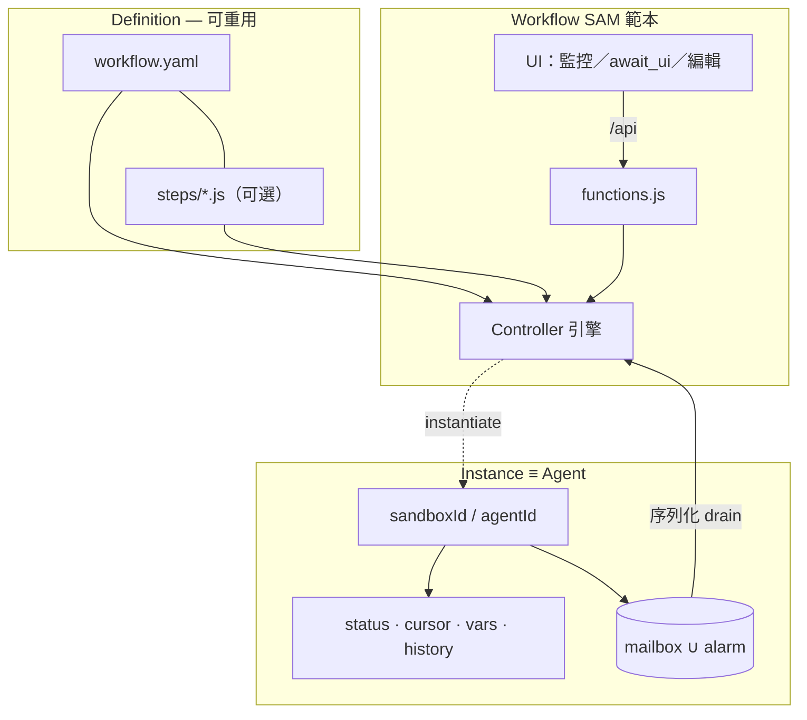
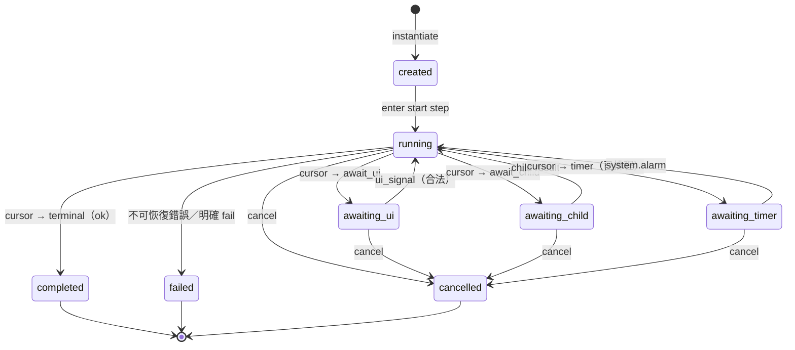
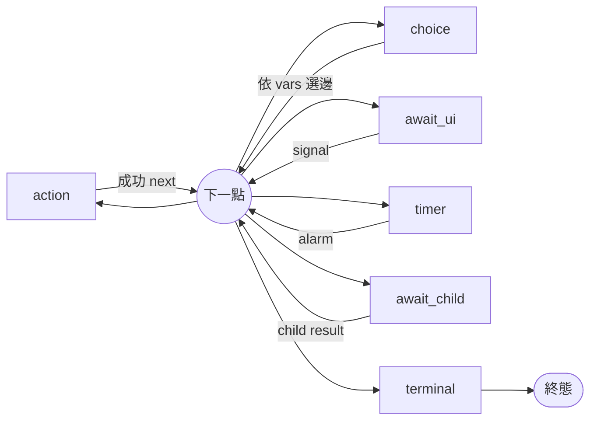
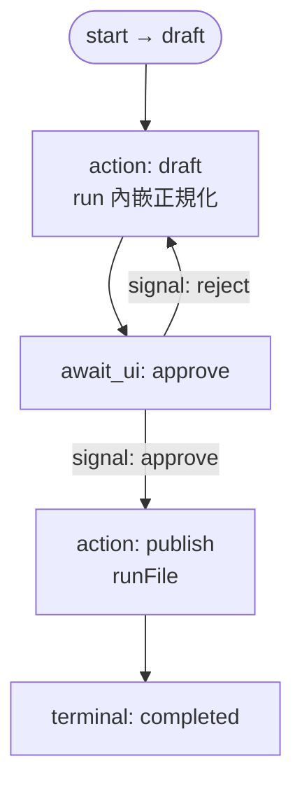
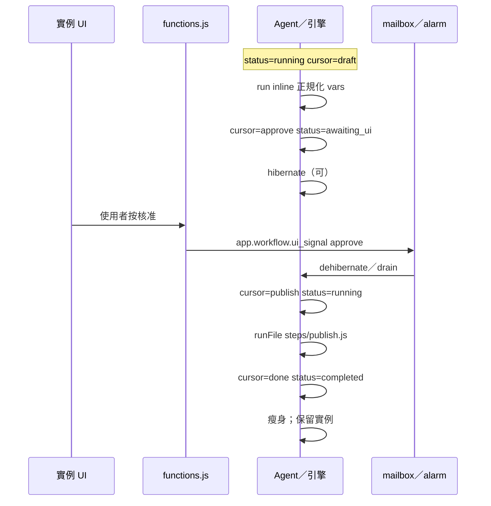

# Playgrounds Workflow Definition Language — `workflow.v1`

本檔定義 Playgrounds 上 **有狀態多步驟流程（workflow）** 的**定義語言**與執行模型邊界。執行原語見 [PG-AGENT-MODEL-SPEC.md](./PG-AGENT-MODEL-SPEC.md)／**DEC-031**。權威決策：**DEC-034**。

一句話：**YAML 流程圖是權威 IR（短碼可內嵌、長碼可外檔）；一流程一 SAM 範本；一實例＝一 Agent（單游標）；人機步驟只走該實例 UI；終態瘦身後仍保留整個 Agent 實例；交付＝獨立 SAM repo，遊樂場不特化。**

**狀態：** 規格初版（2026-08-04；同日修訂：遊樂場零特化／獨立 repo 交付）。交付邊界見 [PG-WORKFLOW-PLAN.md](./PG-WORKFLOW-PLAN.md)。

---

## 1. 定位與邊界

### 1.1 在堆疊中的位置

```text
定義語言（本檔；YAML IR）
        │ 載入／校驗／快照
        ▼
Workflow SAM 範本（Code：引擎＋UI＋workflow.yaml［＋可選 .js］）
        │ instantiate（spawn／開新沙盒）
        ▼
Workflow 實例 ≡ Agent 實例（sandboxId／mailbox／alarm／Durable 狀態）
        │ 單游標狀態機
        ▼
步驟：action｜await_ui｜await_child｜timer｜choice｜terminal
```

| 層 | 本規格的關係 |
| --- | --- |
| **定義（Definition）** | YAML 文件＋可選外部腳本；可版本化；編輯器 IR |
| **實例（Instance）** | 一次執行的權威狀態；生命週期＝該 Agent 沙盒 |
| **Agent Model** | mailbox／alarm／序列化／hibernate／spawn 承載執行；**不**另建流程引擎 runtime |
| **Session 通道** | **非**本規格依賴；人機步驟不走多方 session role |
| **遊樂場介面** | **不**特化 workflow：無內建範本、無定義編譯 hook、無嵌入引擎；僅通用 Agent／畫布／catalog／`?open=` |
| **交付** | 引擎＋範本在**獨立 SAM repo**（小品形）；本站文件只鎖語言與模型 |

### 1.2 目標

- **G1** 提供多數人已熟悉的宣告式定義語言（**YAML**），作為文字編輯與（未來）視覺編輯的**同一內部表示**。
- **G2** 短 JS 可 `run: |` 內嵌；長邏輯**必須**能以 `runFile` 外掛；兩者語意同形。
- **G3** 一流程一 SAM 範本；實例＝Agent；**單一 cursor**。
- **G4** 人機步驟僅該實例 UI（經 `/api`→`functions.js`→mailbox）。
- **G5** 終態清除不必要暫態後，**保留整個 Agent 實例**作紀錄體。
- **G6** 靜態可校驗：互斥欄位、可達終態（建議）、單游標可表達性。
- **G7** 交付與小品相同：獨立 repo；**不**依賴遊樂場 workflow 特化。

### 1.3 非目標

- Playgrounds 遊樂場內建 workflow 範本、YAML 存檔聯動、或嵌入式引擎（見 PLAN）。
- 以 Tool SAM 充當 workflow **runtime**／持有權威游標（Visual Editor Tool SAM 另議，見 §12）。
- 遊樂場內建 BPMN／視覺設計器產品（視覺編輯＝獨立 Tool SAM；本檔只鎖 IR）。
- Exactly-once 跨狀態事務（沿用 DEC-031：先寫狀態再 ack、handler 冪等）。
- 自動跨 peer failover；多寫游標／CRDT。
- 平行多 cursor（fork／join 另議，須升 `apiVersion`）。
- 規定步驟必須使用 LLM。
- 以 JSON 字串作為人類主編格式（JSON 僅可作 AST 序列化／匯出備援）。

---

## 2. 產品決策（摘要）

| ID | 決策 |
| --- | --- |
| D1 | **一流程一 SAM 範本**（引擎＋定義＋UI 同捆；差異主要在定義＋文案） |
| D2 | **單一 cursor**（同一時間至多一個 active step） |
| D3 | **人機僅 UI**（`await_ui`＋`app.workflow.ui_signal`） |
| D4 | **終態保留實例**；只清 mailbox 暫態／可重建快取等 |
| D5 | **YAML＝定義語言／編輯器 IR**；視覺編輯是 IR 的投影 |
| D6 | **`run`（內嵌）與 `runFile`（外檔）皆為一等公民**；互斥 |
| D7 | **獨立 SAM repo 交付**；遊樂場不特化、不內建範本（對齊小品） |

---

## 3. 執行模型

### 3.1 定義 × 實例 × Agent



**不變式：**

1. 一 workflow 實例 ↔ 恰好一權威 Agent（本機預設 `agentId ≡ sandboxId`）。
2. 步驟轉移**只**在該實例序列化 handler 內發生。
3. 外部刺激一律訊息化（見 §7）。
4. 實例啟動時將定義**快照**進 Data（含 `runFile` 內容雜湊或正文副本）；其後改範本不影響已跑實例。
5. 結束＝`status ∈ {completed, failed, cancelled}`；瘦身後實例仍保留（D4）。

### 3.2 單游標狀態機（實例）



| `status` | 含義 |
| --- | --- |
| `created` | 已建立、尚未進入 `start` |
| `running` | 正在執行 action／choice，或剛完成轉移 |
| `awaiting_ui` | 等該實例 UI signal |
| `awaiting_child` | 等子實例結果訊息 |
| `awaiting_timer` | 已排程，等 alarm |
| `completed`／`failed`／`cancelled` | 終態 |

### 3.3 與 Agent Model 的對照

| Workflow 需求 | DEC-031 |
| --- | --- |
| 單線程轉移 | mailbox ∪ alarm 序列化 drain |
| 持久游標／vars | Durable Data／KV；先寫再 ack |
| timer | `ctx.schedule` → `system.alarm` |
| 等待不佔進程 | hibernate；有訊息／alarm 才 resume |
| 子流程 | `spawn` 子 Agent；結果以訊息回報 |
| 冪等 | at-least-once → 以 `eventId`／`stepRunId` 去重 |

---

## 4. 定義語言總則

### 4.1 媒體類型與路徑

| 項目 | 約定 |
| --- | --- |
| 人類主格式 | **YAML 1.2**（UTF-8） |
| 建議路徑 | 沙盒根 `workflow.yaml`（引擎可組態；預設此路徑） |
| 語言 id | `workflow.v1`（文件／校驗用；見頂層 `apiVersion`） |
| 腳本語言 | **JavaScript**（與遊樂場主語言一致） |
| 外檔建議目錄 | `steps/<stepId>.js` 或 `actions/*.js` |

JSON／JS 物件可作**記憶體 AST**或匯出；**不得**要求使用者以 JSON 字串內嵌多行 JS 作為主編體驗。

### 4.2 頂層欄位

| 欄位 | 必填 | 說明 |
| --- | --- | --- |
| `apiVersion` | ★ | 字串 `"1"`（本檔） |
| `kind` | ★ | 固定 `Workflow` |
| `workflowId` | ★ | 穩定 id（範本／血統用；≠ `sandboxId`） |
| `title` | | 顯示名 |
| `description` | | 短說明 |
| `start` | ★ | 起始 `stepId` |
| `steps` | ★ | map：`stepId` → 步驟物件 |
| `vars` | | 初始變數（JSON 相容值） |
| `ui` | | 畫布／編輯器用 metadata（執行忽略語意） |

`stepId`：`^[a-z][a-z0-9_]*$`，於檔內唯一。

### 4.3 步驟共通欄位

| 欄位 | 說明 |
| --- | --- |
| `type` ★ | `action`｜`await_ui`｜`await_child`｜`timer`｜`choice`｜`terminal` |
| `title` | 短標 |
| `ui` | `{ x?, y?, label?, primaryNext? }` 等；供視覺編輯（見 [WFEDIT-SPEC](./PG-WFEDIT-SPEC.md) §5）；執行忽略 |
| `next` | 預設後繼 `stepId`（見各 type） |
| `onError` | 可選：步驟失敗時轉往的 `stepId`；缺省則實例 `failed` |

---

## 5. 步驟類型

### 5.1 總覽



### 5.2 `action`

執行一段邏輯（內嵌或外檔），成功後依 `next`（或腳本回傳覆寫）前進。

| 欄位 | 說明 |
| --- | --- |
| `run` | 多行 JS 字串（YAML `|`／`>`）；與 `runFile` **互斥** |
| `runFile` | 相對沙盒根之路徑；與 `run` **互斥** |
| `builtin` | 可選：具名內建動作（目錄見 §5.2.2）；可與腳本二選一 |
| `next` | 預設後繼；腳本可 `return { next: "other" }` 覆寫（須為已知 stepId） |

**規則：** `run`／`runFile`／`builtin` 三者至少其一；`run` 與 `runFile` 不得並存。

#### 5.2.1 腳本契約

內嵌與外檔編譯／載入後，皆視為：

```js
// 偽簽名（實作可包成 async function）
async function run(ctx) {
  // ctx.vars — 可變；寫回須經引擎提交
  // ctx.stepId, ctx.stepRunId
  // ctx.services — 引擎注入之窄 API（KV／schedule／send…；細節實作定）
  return { ok: true, next?: string, varsPatch?: object, output?: unknown };
}
```

| 回傳 | 語意 |
| --- | --- |
| `{ ok: true, next? }` | 成功；`next` 覆寫預設 |
| `{ ok: false, error? }` | 失敗；走 `onError` 或實例 failed |
| 拋錯 | 同失敗（計入 handler 重試／毒訊息政策，見 Agent Model） |

腳本**必須**可冪等或容忍 at-least-once（建議以 `ctx.stepRunId` 做副作用去重鍵）。

#### 5.2.2 內建 `builtin`（MVP 建議目錄）

實作可子集實作；未實作的 id → 校驗或執行期錯誤。

| `builtin` | 含義（概念） |
| --- | --- |
| `noop` | 無操作，直接 `next` |
| `vars.set` | 依步驟 `params` 合併 vars |
| `log` | 寫入 history／console |

HOST／LLM／`runCmd` 等較重能力：MVP 可先只經腳本 `ctx.services` 暴露，不急著全部建成 `builtin` 字面。

### 5.3 `await_ui`

暫停實例，等待**本實例 UI** 送來合法 signal。

| 欄位 | 說明 |
| --- | --- |
| `form` | 宣告 UI 可蒐集的欄位／選項（引擎＋UI 共用） |
| `on` ★ | map：`signalName` → 後繼 `stepId` |
| `timeout` | 可選：`{ afterMs, next }` 逾時轉移（實作為 timer＋取消） |

`form` 建議形狀（可演進）：

```yaml
form:
  decision:
    type: enum
    options: [approve, reject]
  note:
    type: string
    optional: true
```

UI 經 `functions.js` 投遞（見 §7.1）；**不得**繞過引擎直寫 cursor。

### 5.4 `timer`

| 欄位 | 說明 |
| --- | --- |
| `delayMs` 或 `at` | 相對延遲或絕對時間（ISO）；擇一 |
| `next` ★ | 到期後繼 |

進入步驟時排程 Durable alarm；實例 `status=awaiting_timer`。

### 5.5 `choice`

純轉移，無 I/O。

| 欄位 | 說明 |
| --- | --- |
| `when` ★ | 有序列表：`{ expr, next }`；第一個為真者勝出 |
| `else` ★ | 皆不匹配時的 `stepId` |

`expr`（MVP）：針對 `vars` 的簡易路徑比較，例如：

```yaml
when:
  - { expr: "vars.decision == approve", next: publish }
  - { expr: "vars.count > 3", next: escalate }
else: draft
```

完整運算式語言另釘；MVP 可限 `vars.<key> == <literal>`／數值比較。**禁止**在 `expr` 內執行任意 JS（任意邏輯請用前置 `action`）。

### 5.6 `await_child`

| 欄位 | 說明 |
| --- | --- |
| `spawn` ★ | `{ workflowId? }` 或同範本／路徑約定；細節實作定 |
| `input` | 傳入子實例的初始 `vars` 子集 |
| `on` | `{ completed, failed, cancelled }` → 各後繼 `stepId`（可共用） |
| `next` | 若未細分 `on`，子 `completed` 時的預設後繼 |

父實例單游標停在本步；子為**另一** Agent 實例。子完成以訊息通知父（§7.2）。

### 5.7 `terminal`

| 欄位 | 說明 |
| --- | --- |
| `outcome` | `completed`（預設）｜`failed`｜`cancelled` |
| `summary` | 可選字串模板或固定文案 |

進入即令實例進對應終態，並執行瘦身政策（§8.2）。無 `next`。

---

## 6. 腳本引用正規化

引擎載入定義後，每個 `action` 的腳本正規化為：

```ts
type ScriptRef =
  | { kind: "inline"; source: string }
  | { kind: "file"; path: string }
  | { kind: "builtin"; id: string; params?: Record<string, unknown> };
```

| 規則 | 語意 |
| --- | --- |
| `run`＋`runFile` 並存 | **校驗錯誤** |
| 僅 `runFile` | 讀檔失敗 → 校驗或啟動失敗 |
| 短碼習慣 | 數行邏輯用 `run`；需單測／共用／較長 → `runFile` |
| 語意 | inline／file **同一** `run(ctx)` 契約與權限 |

編輯器可對過長 `run` 提出「建議改外檔」警告，**不**作硬上限（除非實作另定容量）。

---

## 7. 執行期訊息（應用層）

建議 `type` 命名空間 `app.workflow.*`（與 `system.*` 區隔）。

### 7.1 UI → 實例

```json
{
  "type": "app.workflow.ui_signal",
  "payload": {
    "stepId": "approve",
    "signal": "approve",
    "fields": { "note": "lgtm" },
    "eventId": "…"
  }
}
```

| 拒絕條件（例） | 錯誤 |
| --- | --- |
| 實例非 `awaiting_ui` 或 `stepId`≠cursor | `workflow_invalid_state` |
| `signal`∉該步 `on` | `workflow_unknown_signal` |
| 重複 `eventId`（已套用） | 冪等成功／忽略 |

### 7.2 子實例 → 父

```json
{
  "type": "app.workflow.child_finished",
  "payload": {
    "childSandboxId": "…",
    "outcome": "completed",
    "output": {},
    "eventId": "…"
  }
}
```

### 7.3 控制

| `type` | 語意 |
| --- | --- |
| `app.workflow.cancel` | 請求取消 → `cancelled`（可從 awaiting_* 打斷） |
| `app.workflow.start` | `created`→進入 `start`（若未自動開始） |

`system.alarm` 用於 `timer`（Agent Model）。

---

## 8. 實例權威狀態

### 8.1 建議形狀

存放於該沙盒 Data（路徑／KV key 實作定；概念如下）：

| 欄位 | 說明 |
| --- | --- |
| `workflowId`／`apiVersion` | 來自定義 |
| `definitionSnapshot` | 啟動時鎖定的定義＋腳本雜湊／副本 |
| `status` | §3.2 |
| `cursor` | 當前 `stepId` 或 `null`（終態） |
| `stepRunId` | 當前步驟執行世代（冪等用） |
| `vars` | 物件 |
| `history` | `[{ at, stepId, event, detail? }]` |
| `summary`／`error` | 終態摘要 |
| `childSandboxId` | `awaiting_child` 時 |

### 8.2 終態瘦身（保留實例）

| 保留 | 可清 |
| --- | --- |
| 定義快照、`status`、最終 `vars`／outputs | 已 ack 之 mailbox 佇列殘留、inFlight |
| 完整 `history` | 可重建之 runtime 快取 |
| `summary`／`error` | 已歸檔進 history 的 poison 區（政策允許時） |
| 沙盒 Code（範本／當次碼） | 大型中間 artifact（可選移入 `artifacts/` 或丟） |

**不得**因「已完成」而預設刪除 Agent／沙盒；GC 僅經使用者或管理面明確操作。

---

## 9. 靜態校驗（MVP）

校驗器在啟動前（及編輯器存檔時）應拒絕：

1. 未知 `apiVersion`／`kind`≠`Workflow`
2. `start`∉`steps`；`next`／`on.*`／`else`／`onError` 指向未知 id
3. `run`與`runFile` 並存；`action` 三者皆缺
4. `await_ui` 缺 `on` 或 `on` 為空
5. `terminal` 帶 `next`
6. （建議）自 `start` 無法到達任一 `terminal`
7. （建議）存在無法自 `start` 到達的死步——警告或錯誤（實作定）

單游標：**定義語言不得表達「同時兩個 active step」**；平行屬未來 `apiVersion`。

---

## 10. 示例：內容審核流程（模型＋定義）

情境：草稿正規化 → 人工核准 → 通過則發佈、拒絕則回到草稿；可取消。

### 10.1 流程圖（定義視圖）



### 10.2 執行期游標（一次成功路徑）



### 10.3 `workflow.yaml`

```yaml
apiVersion: "1"
kind: Workflow
workflowId: content-review
title: 內容審核
start: draft
vars:
  title: ""
  body: ""

steps:
  draft:
    type: action
    title: 正規化草稿
    run: |
      const title = String(ctx.vars.title || "").trim();
      const body = String(ctx.vars.body || "").trim();
      if (!title || !body) {
        return { ok: false, error: { code: "empty_draft", message: "title/body required" } };
      }
      return {
        ok: true,
        varsPatch: { title, body },
      };
    next: approve
    onError: failed
    ui: { x: 80, y: 120 }

  approve:
    type: await_ui
    title: 人工核准
    form:
      decision:
        type: enum
        options: [approve, reject]
      note:
        type: string
        optional: true
    on:
      approve: publish
      reject: draft
    ui: { x: 280, y: 120 }

  publish:
    type: action
    title: 發佈
    runFile: ./steps/publish.js
    next: done
    onError: failed
    ui: { x: 480, y: 80 }

  done:
    type: terminal
    outcome: completed
    summary: 已發佈
    ui: { x: 680, y: 80 }

  failed:
    type: terminal
    outcome: failed
    summary: 流程失敗
    ui: { x: 480, y: 220 }
```

### 10.4 `steps/publish.js`（外檔示例）

```js
export async function run(ctx) {
  // 長邏輯、可單測；經 ctx.services 寫檔／呼叫 HOST 等（權限由引擎注入）
  await ctx.services.publish?.({
    title: ctx.vars.title,
    body: ctx.vars.body,
  });
  return { ok: true, output: { publishedAt: new Date().toISOString() } };
}
```

（若引擎採「檔案即函式正文」而非 ESM `export`，實作須在範本與本規格附錄釘死一種；**同一範本內須一致**。）

---

## 11. SAM 範本佈局（已定習慣）

交付於**獨立 SAM repo**（非遊樂場 starter）。建議佈局：

```text
/
  index.html          # UI：監控、await_ui 表單、（短期）定義編輯
  workflow.yaml       # 定義 IR（權威）
  controller.js       # 引擎：載入 IR、游標、訊息
  functions.js        # UI／api → 入隊
  steps/              # 可選外檔腳本
    publish.js
  README.md
```

產品敘事：**使用者主要編 `workflow.yaml`（與之後的視覺編輯器）**；進階才改引擎。YAML 編譯／校驗若需要，在**該 SAM 內**完成，不依賴遊樂場。

---

## 12. 編輯器路線（契約約束）

| 階段 | 形態 | 落盤 |
| --- | --- | --- |
| 短期 | Workflow SAM 內文字／表單編輯 YAML；校驗（SAM 內） | `workflow.yaml`＋`runFile`／執行用定義模組 |
| 長期 | **Workflow Visual Editor＝獨立 Tool SAM**（建議 `sampot/pg-wfedit`） | **同一 YAML IR**；座標進 `ui`；短碼↔`run`；抽檔↔`runFile` |

產品／UX／往返細節以 **[PG-WFEDIT-SPEC.md](./PG-WFEDIT-SPEC.md)** 為準；階段見 [PG-WFEDIT-PLAN.md](./PG-WFEDIT-PLAN.md)。

**硬規則：**

1. 視覺編輯器**不得**另立執行語意；只能讀寫本語言可表達的圖＋腳本引用。
2. 視覺編輯器**是 Tool SAM**（另 repo，小品形），**不是**遊樂場內建、也**不是** workflow runtime。
3. Runtime 仍在 **Workflow Agent SAM**；Tool 經 grant 改宿主的 `workflow.yaml`／定義模組後，由流程實例自行重載／重跑。
4. **不得**以 Tool SAM 充當引擎或持有流程權威狀態（KV 游標）。
5. **垂直主軸（TB）**為預設投影；水平僅作分支短岔（WFEDIT-SPEC E2）。

---

## 13. 錯誤碼（機器可讀，建議）

| code | 何時 |
| --- | --- |
| `workflow_invalid_definition` | 校驗失敗 |
| `workflow_invalid_state` | 訊息與 status／cursor 不符 |
| `workflow_unknown_signal` | await_ui 未知 signal |
| `workflow_script_error` | 腳本失敗（可附 cause） |
| `workflow_child_missing` | await_child 結果對不上 |
| `workflow_cancelled` | 已取消後的冗餘刺激 |

---

## 14. 相關文件

| 文件 | 關係 |
| --- | --- |
| [DEC-034](./DECISIONS.md#dec-034-playgrounds-workflow-定義與實例模型) | 本語言與實例模型之 ADR |
| [PG-AGENT-MODEL-SPEC.md](./PG-AGENT-MODEL-SPEC.md) | mailbox／alarm／spawn／hibernate |
| [GLOSSARY.md](./GLOSSARY.md) | 用語 |
| [PG-WORKFLOW-PLAN.md](./PG-WORKFLOW-PLAN.md) | 交付邊界：獨立 SAM；遊樂場零特化 |
| [PG-WFEDIT-SPEC.md](./PG-WFEDIT-SPEC.md) | Visual Editor（`pg-wfedit`）產品／UX 契約 |
| [PG-WFEDIT-PLAN.md](./PG-WFEDIT-PLAN.md) | Visual Editor 實作階段 |
| [PG-DEV-TOOLS-BACKLOG.md](./PG-DEV-TOOLS-BACKLOG.md) | 小品「一 SAM 一 repo」慣例（對齊交付形） |
